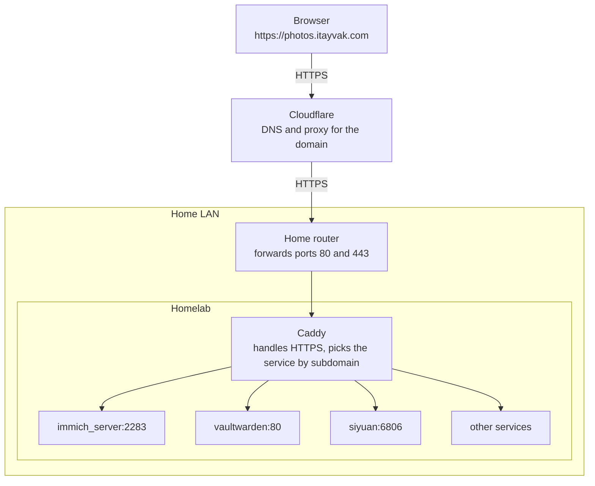

# Networking

This section describes how traffic gets from the internet to the services on the homelab.

## How a request travels

Caddy and the service containers are connected by the Docker network `homelab`, which is how Caddy reaches a container by its name.

Each step has its own page:

| Page                              | What it covers                                                   |
| --------------------------------- | ---------------------------------------------------------------- |
| [Domain](domain.md)               | The domain, Cloudflare DNS and the DDNS container                |
| [Router](router.md)               | The port forwarding the router needs                             |
| [Reverse proxy](reverse-proxy.md) | Caddy: routes, HTTPS, and how to add a new service               |
